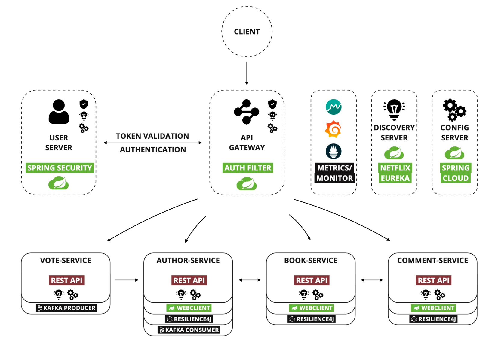
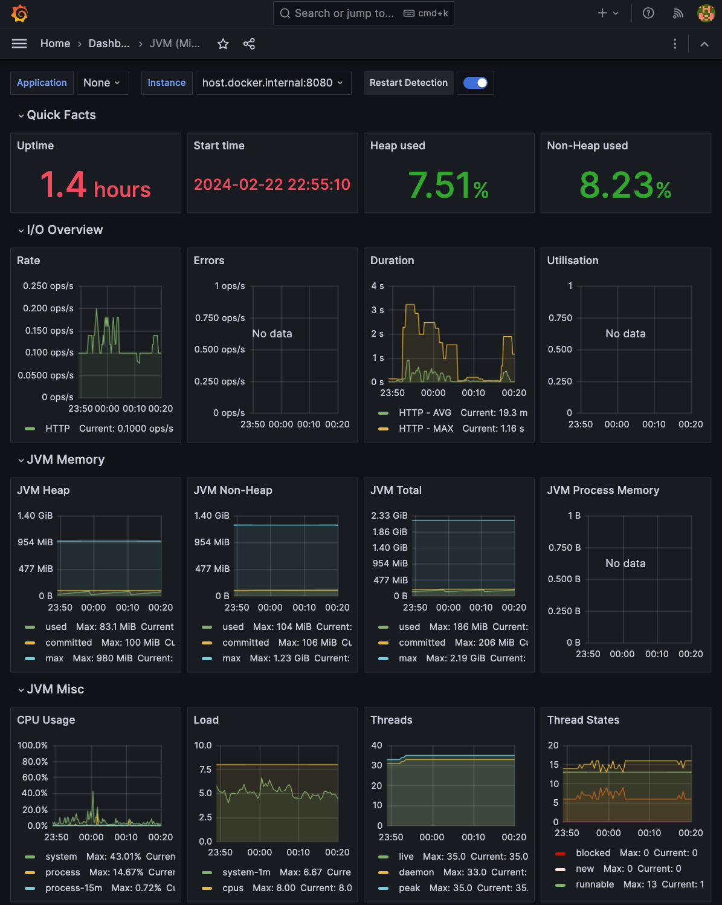

# Book Library

## Overview

This repository contains a sample implementation of the Book Library system built using Spring Cloud microservices architecture. The project is divided into several microservices, each responsible for specific functionalities such as managing books, authors, comments, user authentication, and more.

## Infrastructure

The infrastructure of the system follows the principles of microservices, where each microservice is designed to be independently deployable and scalable. The system employs reactive programming with Spring WebFlux to handle asynchronous and non-blocking I/O operations efficiently.



In the Book Library application, robust communication and real-time event handling are prioritized through the strategic integration of WebClient with Resilience4j for resilience.

### Discovery Server
Uses Eureka server for service registration and discovery, ensuring seamless communication between microservices. Access Eureka dashboard at `http://localhost:8761` after it's up and running.

### WebClient with Resilience4j
Book Library utilizes WebClient along with Resilience4j for managing incoming requests and ensuring resilience in communication with external APIs or services. WebClient provides a non-blocking, reactive approach to HTTP requests, while Resilience4j offers a powerful library for implementing resilience patterns such as circuit breakers, retries, and rate limiting. By combining these tools, Book Library fortifies itself against potential failures and gracefully handles unexpected scenarios, maintaining optimal performance, resilience, and responsiveness in its interactions with external systems.

### Kafka Integration for Voting Authors
Book Library seamlessly integrates with Kafka to facilitate real-time processing of voting for authors across the microservices ecosystem. Kafka serves as a distributed streaming platform, enabling seamless communication between microservices and providing reliable, scalable, and fault-tolerant messaging. By leveraging Kafka's publish-subscribe model, Book Library efficiently handles voting events, ensuring that updates regarding author ratings and popularity are promptly propagated throughout the system. This integration enhances the overall voting experience for users and enables Book Library to effectively capture and respond to user preferences in real-time, fostering a dynamic and engaging user experience.

### Gateway Server
Central entry point routing requests to microservices, providing a unified interface for clients. Once all microservices are running, access the gateway server at `http://localhost:8080` to interact with the system's functionalities.

### Prometheus
The web interface of Prometheus, which is typically accessible at `http://localhost:9090` when running locally, provides a user-friendly way to explore collected metrics, run queries, and manage alerting configurations.

### Grafana
Accessing the Grafana dashboard at `http://localhost:3000` with the provided credentials (username: admin, password: admin) allows to log in and start exploring the metrics and visualizations configured within Grafana.

**Note**: To connect Grafana with Prometheus, use `http://host.docker.internal:9090` as the data source URL.

## Functional Services

### Book Service
Allows users to perform operations on books, view detailed information such as title, author, genre, publication date, and ratings, and interact with comments.

  | Method | Path                          | Description                                                            |
  |--------|-------------------------------|------------------------------------------------------------------------|
  | GET    | /api/v1/books/user/{id}/count | Get the count of books voted by a specific user                        |
  | GET    | /api/v1/books                 | Get all books, optionally sorted by rating or creation date            |
  | GET    | /api/v1/books?genre           | Get all books by genre, optionally sorted by rating or creation date   |
  | GET    | /api/v1/books/{id}            | Get a specific book with author information and comments               |
  | GET    | /api/v1/books?author          | Get all books by author, optionally sorted by rating or creation date  |
  | GET    | /api/v1/books?user            | Get all books by user, optionally sorted by positive or negative votes |
  | GET    | /api/v1/genres                | Get all genres, sorted by name in ascending order                      |

### Author Service
Provides author profiles, including biographical information and statistics. Users can search for authors and explore their data.

  | Method | Path                            | Description                                            |
  |--------|---------------------------------|--------------------------------------------------------|
  | GET    | /api/v1/authors/user/{id}/count | Get the count of users who voted for a specific author |
  | GET    | /api/v1/authors/{id}            | Get a specific author                                  |
  | GET    | /api/v1/authors/user/{id}       | Get all authors voted by a specific user               |

### Comment Service
Manages user comments on books, including fetching by book or user ID, counting by user ID, and sorting by popularity or recency. Users can post, reply, and engage in discussions.

  | Method | Path                             | Description                                                            |
  |--------|----------------------------------|------------------------------------------------------------------------|
  | GET    | /api/v1/comments/user/{id}/count | Get the count of comments made by a specific user                      |
  | GET    | /api/v1/comments/book/{id}       | Get all comments for a specific book, sorted by creation date          |
  | GET    | /api/v1/comments/user/{id}       | Get all comments made by a specific user, with associated book details |

### User Server
Implements secure user registration, authentication via username/password, and JWT-based token authentication.

  | Method | Path                  | Description                                        |
  |--------|-----------------------|----------------------------------------------------|
  | POST   | /api/v1/auth/signup   | Sign up a new user                                 |
  | POST   | /api/v1/auth/signin   | Sign in a user                                     |
  | POST   | /api/v1/auth/validate | Validate a token                                   |
  | GET    | /api/v1/user/my       | Get account information for the authenticated user |
  | GET    | /api/v1/user/{id}     | Get information for a specific user                |

## Metrics and Monitoring with Micrometer, Grafana, and Prometheus

### Micrometer

- Provides a simple API for capturing application-level metrics.
- Supports various metric types like counters, gauges, timers, and histograms.
- Integrates seamlessly with monitoring system Prometheus.

### Prometheus


- Collects time-series data through a pull-based model.
- Offers a powerful querying language (PromQL) for analyzing metrics.
- Automatically discovers targets and supports a multi-dimensional data model.

### Grafana



- Visualizes time-series data with customizable dashboards and graphs.
- Supports various data sources including Prometheus
- Provides alerting capabilities for setting up notifications based on predefined thresholds.

## Setup Instructions

1. **Clone Repository**: Clone this repository to your local machine.

2. **Build Microservices**: Build each microservice using Maven (by default) or Gradle. Ensure that all dependencies are resolved.

3. **Run Eureka Server**: Start the Eureka server by running the `EurekaDiscoveryServerApplication` class.

4. **Run Microservices**: Start each microservice individually, ensuring that they register themselves with the Eureka server.

5. **Access Gateway Server**: Once all microservices are running, access the gateway server to interact with the system's functionalities.

## Docker Setup and Starting the Application

1. **Clone Repository**: Clone the repository containing the microservices setup to your local machine.

2. **Build Docker Images**: Build Docker images for each microservice by running the following command in the terminal:

   ```bash
   docker-compose build
3. **Start Docker Containers**: Start the Docker containers for all services defined in the docker-compose.yml file by running:

   ```bash
   docker-compose up

4. **Access Gateway Server**: Once all microservices are running, access the gateway server to interact with the system's functionalities.

### HTTP requests:

To test the program, you can utilize the `booklibrary-microservices.http` file, which comprises a collection of HTTP requests, directly within IntelliJ IDEA Ultimate or any other HTTP client that supports cURL or importing HTTP requests.

**Note**: *Make sure you have placed the JWT token in the `http-client.private.env.json` file to enable the `auth_token` placeholder in the authorization header.*

## Contributors

- Fedor Bondarev